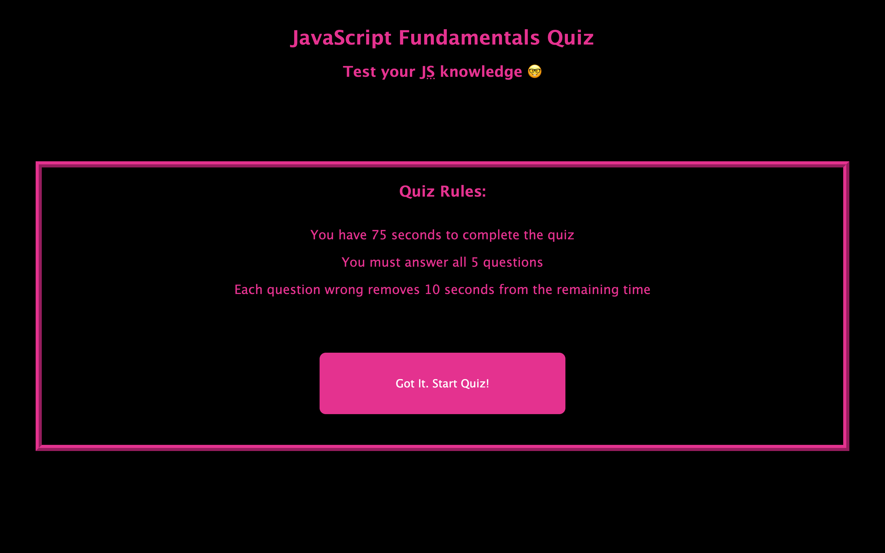

# javascript-quiz
A 5 question quiz on the fundamentals of JavaScript, powered by JavaScript

## Description

This project was created to show how JavaScript can manipulate data and control HTML elements using Web APIs. Web APIs allow JavaScript to target HTML elements and do all sorts of things with them. This is known as *DOM traversal*. By using Web APIs, I was able to write little HTML and display content using mainly JavaScript. Simple HTML tags and id attributes were made to give the website a basic layout. Then, I was able to target those elements using JavaScript Web APIs and do things like add and change text content, have certain things happen when the user clicks a button (known as JavaScript *events*), and display local storage as text on the page. This was an excellent exercise to help use and understand Web APIs.

During this project, I learned about how JavaScript can control HTML elements with hardly any HTML code written. Using Web APIs, I could target empty HTML elements and fill them with content. I also learned about important and powerful APIs called *Event Listeners*. These event listeners allow things to change when, for example, the user clicks a button. I learned how to store user button clicks into a variable, add user input to an array, and iterate through those arrays to display data on the page. Finally, a lot of time was spent manipulating *local storage*. Local storage allows the user to save data to their browser in which JavaScript can access. This allowed me to display the user's past scores on the results screen after they press the "Submit Score" button.

## Usage

Upon clicking the link to the webpage (see "Links" below), the user will be directed to a webpage containing a "JavaScript Fundamentals" quiz, with its rules and a button to start. Click the start button to begin the quiz. A timer of 75 seconds will then pop up. There are 5 questions. Each question has 4 answers buttons and only one answer is correct. You must click an answer button to go to the next question. After clicking an answer button, the text "// Correct!" will appear if your answer is correct or "// Incorrect!" if your answer is incorrect. Also, if you get a question wrong, 10 seconds is taken off the timer. If the timer hits 0, you will be returned to the home screen and will have to restart the quiz. After answering all 5 questions, you will be taken to a results screen, where you are able to save your initials and score by clicking the "Submit Score" button. Your current quiz score as well as your past scores will then pop up. Submitting your score is not required. The "Return Home" button will then bring you back to the home screen. You may take the quiz as many times as you'd like.

See "Video" below for a visual demonstration.

## Links 

    * 

    *

## Video

## Screenshot

